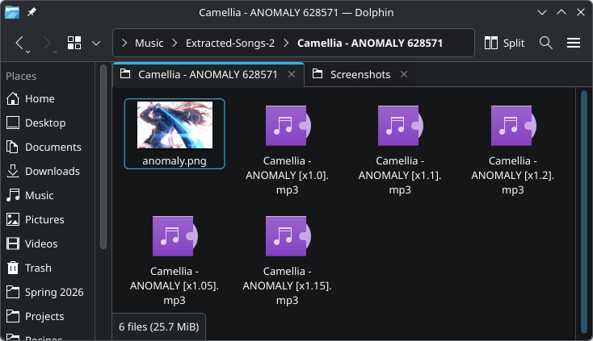
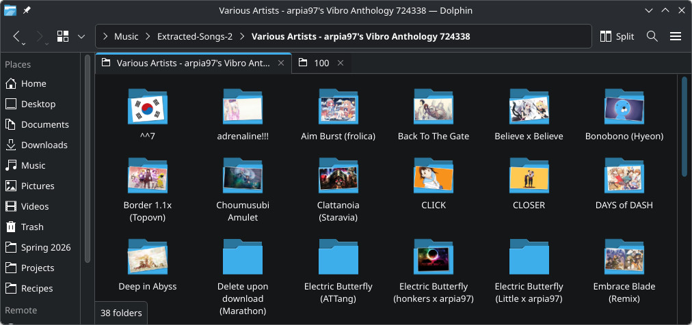
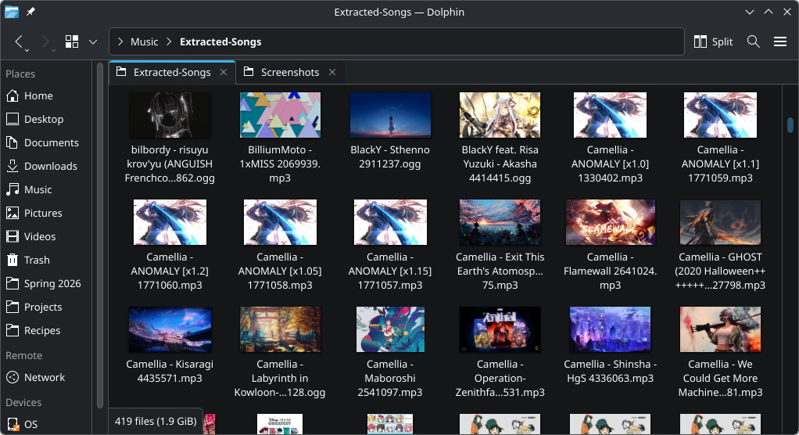

# Configuration Guide
The configuration file is called osu-song-extractor.cfg. When you first download this tool, osu-song-extractor.cfg is filled with all the default settings commented out.

# Table of Contents
1. [Configuration Options](#configuration-options)
    1. [Section Headers](#section-headers)
    2. [\[General\] Options](#general-options)
    3. [\[Beatmap Type\] Options](#beatmap-type-options)
2. [Replacement Fields](#replacement-fields)
3. [Comments](#comments)
4. [Examples](#examples)

# Configuration Options
## Section Headers
There are 4 section headers:

**\[General\], \[One\_Song\], \[Rates\], \[Map\_Pack\]**

**\[General\]** configurations apply to every beatmap set, and one of the three **\[*Beatmap Type*\]** configurations will also apply each beatmap set. The beatmap sets are categorized based on the number of songs and backgrounds listed in its .osu files. The formula is as follows:

- If a beatmap set has one or fewer songs, it is categorized as **\[One\_Song\]**. [This is an example](https://osu.ppy.sh/beatmapsets/173612#mania/480207).
- Otherwise, if the number of backgrounds is less than the number of songs \* `beatmap_type_cutoff` (default 0.7), it gets categorized into **\[Rates\]**. [This is an example](https://osu.ppy.sh/beatmapsets/480479#mania/1026063).
- Otherwise, it gets categorized into **\[Map\_Pack\]**. [This is an example](https://osu.ppy.sh/beatmapsets/1572720#mania/3470136).

The purpose of these headers is to apply different configuration options depending on the type of beatmap set. For example, beatmap sets categorized into **\[Rates\]** probably contain different rates of the same song, so including `"<Version>"` (the difficulty name) in the exported song's filename / metadata may be beneficial.

## \[General\] Options
### input\_dir
This is the path to your Osu Songs folder. There is no default for this option.

Example:
```
input_dir = "C:\Users\{Username}\AppData\Local\osu!\Songs"
```

### output\_dir
This is where the songs will get copied to. There is no default for this option.

Example:
```
output_dir = "C:\Users\{Username}\Music\Extracted-Songs"
```

### export\_into\_subfolders
`True`: export each beatmap into a different subfolder \
`False`: export each beatmap in the top-level output directory \
Default: `True`

### subfolder\_name
Name of each subfolder if `export_into_subfolders` is `True`. Supports [replacement fields](#replacement-fields). \
Default: `"<Artist> - <Title> <BeatmapSetID>"`

### illegal\_char\_override
Sometimes, the values in the .osu file will have illegal filename characters (`<, >, :, ", /, \, |, ?, *`). If you then use a replacement field, this can lead to illegal folder / file names. What should the illegal character(s) be replaced with? \
Default: `"-"`

### beatmap\_type\_cutoff
This program attempts to differentiate between beatmap sets that are different rates of the same song, or beatmap sets that are map packs. It does that with the formula described in the [Section Headers section](#section-headers). In that formuala, there is a special configurable variable called `beatmap_type_cutoff`. What should that variable be set to? \
Default: `0.7`

## \[Beatmap Type\] Options
These are the options for **\[One\_Song\]**, **\[Rates\]**, and **\[Map\_Pack\]**.

### export\_into\_deep\_subfolder
Whether or not to create a deeper subfolder for each audio file. \
Default: `True` for **\[map\_pack\]**, `False` for all other beatmap types

### deep\_subfolder\_name
What name to give the deeper subfolders if `export_into_deep_subfolder` is `True`. Supports [replacement fields](#replacement-fields). \
Default: `"<Version>"`

### overwrite\_existing\_files
Whether or not to overwrite existing files in the output directory with the same filename. Possible values are `True`, `False`. \
Default: `False`

### song\_filename
What name to give the exported song. Supports [replacement fields](#replacement-fields). \
Default: `"<Artist> - <Title>"` for **\[One\_Song\]**, `"<Artist> - <Title> [<Version>]"` for **\[Rates\]**, `"<Artist> - <Version>"` for **\[Map\_Pack\]**

### meta\_write\_mode
When to write the output song's title and artist metadata, based on if it's present in the original file. Possible values are `NEVER`, `IF_MISSING`, `ALWAYS`. \
Default: `IF_MISSING`

### title\_meta
What metadata to write to the exported song's title field. Supports [replacement fields](#replacement-fields). \
Default: `"<Title>"` for **\[One\_Song\]**, `"<Title> [<Version>]"` for **\[Rates\]**, `"<Version>"` for **\[Map\_Pack\]**

### artist\_meta
What metadata to write to the exported song's artist field. Supports [replacement fields](#replacement-fields). \
Default: `"<Artist>"` 

### bg\_export\_mode
How to export the background(s). \
`NEVER`: Don't export the background(s). \
`AS_SEPARATE`: Export all backgrounds as a separate file in the same directory as the output audio file. \
`AS_META_IF_MISSING`: Export one background as part of the output file's metadata only if it's missing from the original audio file. \
`AS_META_ALWAYS`: Export one background as part of the output file's metadata even if it already exists in the original audio file.

Note about `AS_META_IF_MISSING` and `AS_META_ALWAYS`: If the same song uses mutliple backgrounds, only one of the backgrounds will be exported as metadata, and which background gets exported is not defined. 

Default: `AS_SEPARATE`

### bg\_filename
What name to give the exported background image if `bg_export_mode` is `AS_SEPARATE`. Supports [replacement fields](#replacement-fields). \
Default: `"<BackgroundFilename>"`

# Replacement Fields
Some options support replacement fields, which are denoted by angle brackets `<>`. The following replacement fields are accepted:

**\<AudioFilename\>, \<Title\>, \<Artist\>, \<Version\>, \<BackgroundFilename\>, \<BeatmapID\>, \<BeatmapSetID\>**

Look online for the [.osu file format documentation](https://osu.ppy.sh/wiki/en/Client/File_formats/osu_%28file_format%29) for more details about what each of these mean. Also, the program automatically strips the extension for folders and adds the correct extension for filenames, so no need to worry about that.

# Comments
Comments are anything to the right of a `#` character. This is text that the program will ignore. Examples:
```
# this is a comment

input_dir="~/Music/Songs" # This is also a comment, and input_dir will still be read correctly

#export_into_subfolders = False # This whole line is a comment, so the program ignores this line
```

# Examples
## Default Options
If you only fill out input_dir and output_dir in osu\_song\_extractor.cfg, all beatmap sets will be exported into their own subfolder. The subfolders will be formatted as shown below.


*Most subfolders have a flat layout like this.*
<br><br><br>

*Map packs get exported with each beatmap in a deeper subfolder.*

## Export Background As Metadata
The following osu\_song\_extractor.cfg gives no subdirectories, and every song is exported with its background as metadata (excluding audio files that already had artwork in them). I also appended \<BeatmapID\> to the filenames in order to prevent any name clashes, but you can omit this if you want.

*osu\_song\_extractor.cfg*
```
[General]
input_dir = " " # Change this to your songs folder location
output_dir = " " # Change this to whatever you want your output location to be
export_into_subfolders = False

[One_Song]
export_into_deep_subfolder = False
song_filename = "<Artist> - <Title> <BeatmapID>"
bg_export_mode = AS_META_IF_MISSING

[Rates]
export_into_deep_subfolder = False
song_filename = "<Artist> - <Title> [<Version>] <BeatmapID>"
bg_export_mode = AS_META_IF_MISSING

[Map_Pack]
export_into_deep_subfolder = False
song_filename = "<Artist> - <Version> <BeatmapID>"
bg_export_mode = AS_META_IF_MISSING
```


*Screenshot of output folder.*
